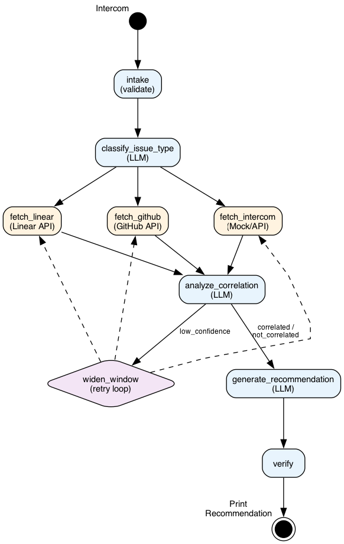

# Support Ticket Triage Graph

A LangGraph-based automation that triages support tickets by correlating them with recent code changes (GitHub PRs) and deployed features (Linear tickets).

**Core question the graph answers:** _"Is this customer issue related to something we recently shipped?"_

## Graph Architecture



**Node Types:**

- **Blue (Orchestrators)**: LLM-powered nodes that classify, analyze, and recommend
- **Orange (Tool Agents)**: API integrations (GitHub, Linear, Intercom)
- **Purple (Decision)**: Retry loop for low-confidence results

**Key Features:**

- Fan-out/fan-in pattern for parallel API fetches
- Conditional routing based on correlation confidence
- Retry loop that widens the search window (1 → 3 → 7 days)
- Recurring pattern detection across recent tickets

## Setup

```bash
# Create virtual environment
python -m venv .venv
source .venv/bin/activate

# Install dependencies
pip install -r requirements.txt

# Install Graphviz for diagram rendering (optional)
brew install graphviz  # macOS
# apt install graphviz  # Linux
```

## Configure

Copy `.env.example` to `.env` and configure:

```bash
cp .env.example .env
```

Required:

- `GITHUB_TOKEN` - GitHub personal access token
- `LINEAR_API_KEY` - Linear API key

Optional:

- `LANGSMITH_API_KEY` - For tracing (recommended)
- `TRIAGE_REPOS_*` - Configure which repos to search per classification

Make sure Ollama is running with llama3.2:

```bash
ollama pull llama3.2
ollama serve
```

## Run

```bash
# Run on a sample ticket
python -m src.main

# Or use the interactive notebook
jupyter notebook walkthrough.ipynb
```

## Run Evaluations

```bash
# Run all 18 golden set test cases
python -m evals.run

# Run specific category
python -m evals.run --category tool_usage
python -m evals.run --category task_completion
python -m evals.run --category hallucination_resistance
python -m evals.run --category routing
python -m evals.run --category error_handling

# Run single case
python -m evals.run --case GS-01

# Save results
python -m evals.run --output evals/results/
```

### Evaluation Categories

| Category | Cases | What It Tests |
|----------|-------|---------------|
| `tool_usage` | 5 | Correct repos fetched based on classification |
| `task_completion` | 5 | Valid outputs produced (recommendation, tags, etc.) |
| `hallucination_resistance` | 3 | matched_item exists in fetched data |
| `routing` | 2 | Retry logic respects max attempts |
| `error_handling` | 3 | Invalid inputs handled gracefully |

## Project Structure

```
├── src/
│   ├── graph.py          # LangGraph construction
│   ├── nodes.py          # Node functions (intake, classify, fetch, analyze, etc.)
│   ├── state.py          # TriageState TypedDict
│   ├── prompts.py        # LLM prompts
│   ├── tools/            # GitHub and Linear API integrations
│   └── providers/        # Intercom provider (mock/real)
├── evals/
│   ├── golden_set.yaml   # 18 test cases across 5 categories
│   ├── evaluator.py      # Evaluation harness
│   └── run.py            # CLI runner
├── data/
│   ├── mock_intercom.yaml      # Public mock data
│   └── proprietary/            # Gitignored company-specific data
└── walkthrough.ipynb     # Interactive demo notebook
```

## Customization

Configure repos and Linear projects via environment variables:

```bash
# Repo mapping by classification
TRIAGE_REPOS_FRONTEND=your-org/frontend
TRIAGE_REPOS_BACKEND=your-org/backend
TRIAGE_REPOS_INFRA=your-org/infrastructure

# Linear projects to search
TRIAGE_LINEAR_PROJECTS=ENG,INFRA
```

For company-specific mock data, create `data/proprietary/mock_intercom.yaml` (gitignored).
